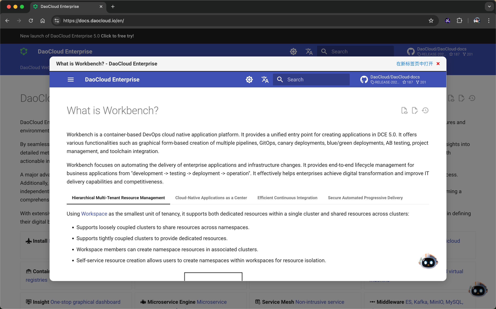

# TabBoost

## 简介

TabBoost 是一款 Chrome 扩展，灵感来源于我对 Arc 浏览器的深度使用。作为一名长期使用 Chrome 的用户，我很喜欢其与 Google 帐号同步的便捷体验。尽管如此，我也欣赏 Arc 浏览器中的一些独特设计，尤其是针对用户体验的细节优化。经过近两年在 Arc 中的使用，且在此期间频繁切换回 Chrome，我决定将 Arc 中最常用的功能复刻到 Chrome 上。

目前，TabBoost 的最小可用版本（MVP）已经完成，并且已经能够满足我个人的需求。虽然我并不是一个经验丰富的 JavaScript 开发者，但得益于大语言模型的支持，我顺利完成了这一项目的开发。我用了一个工作日的晚上和周六的早晨完成了这段代码。

该插件尚未经过完整测试，目前仅在我的个人设备上运行，仍有不少优化空间。未来我将持续改进，如果你有兴趣，欢迎提出 Issue 或提交 Pull Request。

## 功能

- [x] **复制当前标签页：** 使用快捷键 `Ctrl+M` 快速复制当前标签页，并自动切换到新标签页。
- [x] **复制当前标签页网址：** 使用快捷键 `Shift+Command+C` 快速复制当前标签页的网址到剪贴板，并在右上角显示提示信息。
- [x] **自定义快捷键：** 您也可以在 Chrome 插件的快捷键管理中的设置自定义快捷键。
- [x] 支持 `Arc Boost` 的方式弹窗打开，并在有需要时才在新 Tab 打开。
  - [x] 按住 `Command` 键点击链接时，弹窗打开链接，Arc 使用的是 `Shift` 键，这里我选择了 `Command` 键，因为我更习惯这样的操作
  - [x] 支持使用 `Esc` 快速关闭当前弹窗
- [x] 支持 `Split View Mode`，：按住 `Shift+Command`键点击链接时，支持在当前标签页中并排显示两个网页，左右分屏浏览。

## 安装

1. 打开 Chrome 浏览器，访问 `chrome://extensions/`。
2. 打开右上角的“开发者模式”开关。
3. 点击“加载已解压的扩展程序”按钮。
4. 选择 `TabBoost` 文件夹。

## 使用

安装完成后，您可以使用以下快捷键：

- `Ctrl+M`：复制当前标签页
- `Shift+Command+C`：复制当前标签页网址
- `Command` + 点击链接：弹窗打开链接

您也可以在 Chrome 插件的快捷键管理中的设置自定义快捷键。

## 快捷键设置

1. 在 Chrome 浏览器的工具栏中找到 TabBoost 图标，右键单击并选择“选项”。
2. 在设置页面中，您可以自定义每个功能的快捷键。

## 贡献

欢迎贡献代码！如果您有任何建议或发现任何问题，请提交 Issue 或 Pull Request。

## 许可证

本项目采用 [MIT 许可证](LICENSE)。
